# 

This document describes the output produced by the pipeline. Most of the plots are taken from the MultiQC report, which summarises results at the end of the pipeline.

## Pipeline overview

The pipeline is built using [Nextflow](https://www.nextflow.io/). See [`main README.md`](../README.md) for a condensed overview of the steps in the pipeline, and the bioinformatics tools used at each step.

See [Illumina website](https://emea.illumina.com/science/sequencing-method-explorer/kits-and-arrays/atac-seq.html) for more information regarding the ATAC-seq protocol, and for an extensive list of publications.

The directories listed below will be created in the output directory after the pipeline has finished. All paths are relative to the top-level results directory.

## Library-level analysis

The initial QC and alignments are performed at the library-level e.g. if the same library has been sequenced more than once to increase sequencing depth. This has the advantage of being able to assess each library individually, and the ability to process multiple libraries from the same sample in parallel.

### Raw read QC

    
Output files

* `fastqc/`
    * `*_fastqc.html`: FastQC report containing quality metrics for read 1 (*and read2 if paired-end*) **before** adapter trimming.
* `fastqc/zips/`
    * `*_fastqc.zip`: Zip archive containing the FastQC report, tab-delimited data file and plot images.

[FastQC](http://www.bioinformatics.babraham.ac.uk/projects/fastqc/Help/) gives general quality metrics about your reads. It provides information about the quality score distribution across your reads, the per base sequence content (%A/C/G/T). You get information about adapter contamination and other overrepresented sequences.

### Adapter trimming

    
Output files

* `trim_galore/`
    * `*fastq.gz`: If `--save_trimmed` is specified, FastQ files **after** adapter trimming will be placed in this directory.
* `trim_galore/logs/`
    * `*.log`: Log file generated by Trim Galore!.
* `trim_galore/fastqc/`
    * `*_fastqc.html`: FastQC report containing quality metrics for read 1 (*and read2 if paired-end*) **after** adapter trimming.
* `trim_galore/fastqc/zips/`
    * `*_fastqc.zip`: Zip archive containing the FastQC report, tab-delimited data file and plot images.

[Trim Galore!](https://www.bioinformatics.babraham.ac.uk/projects/trim_galore/) is a wrapper tool around Cutadapt and FastQC to consistently apply quality and adapter trimming to FastQ files. By default, Trim Galore! will automatically detect and trim the appropriate adapter sequence. For most ATAC-seq datasets this will be the Nextera adapter sequence 'CTGTCTCTTATA'. See [`usage.md`](usage.md) for more details about the trimming options.

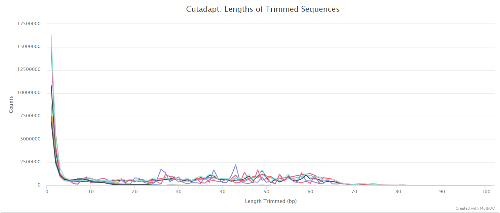

### Alignment

    
Output files

* `bwa/library/`
    * `*.bam`: The files resulting from the alignment of individual libraries are not saved by default so this directory will not be present in your results. You can override this behaviour with the use of the `--save_align_intermeds` flag in which case it will contain the coordinate sorted alignment files in [`*.bam`](https://samtools.github.io/hts-specs/SAMv1.pdf) format.
* `bwa/library/samtools_stats/`
    * SAMtools `*.flagstat`, `*.idxstats` and `*.stats` files generated from the alignment files.

> **NB:** File names in the resulting directory (i.e. `bwa/library/`) will have the '`.Lb.`' suffix.

Adapter-trimmed reads are mapped to the reference assembly using [BWA](http://bio-bwa.sourceforge.net/bwa.shtml). A genome index is required to run BWA so if this is not provided explicitly using the `--bwa_index` parameter then it will be created automatically from the genome fasta input. The index creation process can take a while for larger genomes so it is possible to use the `--save_reference` parameter to save the indices for future pipeline runs, reducing processing times.

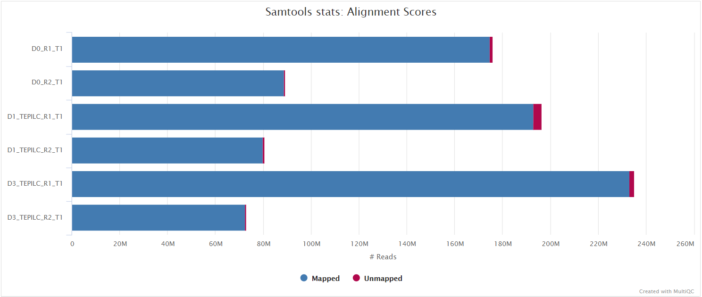

## Merged library-level analysis

The library-level alignments associated with the same sample are merged and subsequently used for the downstream analyses.

### Alignment merging, duplicate marking, filtering and QC

    
Output files

* `bwa/mergedLibrary/`
    * `*.bam`: Merged library-level, coordinate sorted `*.bam` files after the marking of duplicates, and filtering based on various criteria. The file suffix for the final filtered files will be `*.mLb.clN.*`. If you specify the `--save_align_intermeds` parameter then two additional sets of files will be present. These represent the unfiltered alignments with duplicates marked (`*.mLb.mkD.*`), and in the case of paired-end datasets the filtered alignments before the removal of orphan read pairs (`*.mLb.flT.*`).
* `bwa/mergedLibrary/samtools_stats/`
    * SAMtools `*.flagstat`, `*.idxstats` and `*.stats` files generated from the alignment files.
* `bwa/mergedLibrary/picard_metrics/`
    * `*_metrics`: Alignment QC files from picard CollectMultipleMetrics.
    * `*.metrics.txt`: Metrics file from MarkDuplicates.
* `bwa/mergedLibrary/picard_metrics/pdf/`
    * `*.pdf`: Alignment QC plot files from picard CollectMultipleMetrics.
* `bwa/mergedLibrary/preseq/`
    * `*.ccurve.txt`: Preseq expected future yield file.

> **NB:** File names in the resulting directory (i.e. `bwa/mergedLibrary/`) will have the '`.mLb.`' suffix.

[Picard MergeSamFiles and MarkDuplicates](https://broadinstitute.github.io/picard/command-line-overview.html) are used in combination to merge the alignments, and for the marking of duplicates, respectively. If you only have one library for any given replicate then the merging step isnt carried out because the library-level and merged library-level BAM files will be exactly the same.

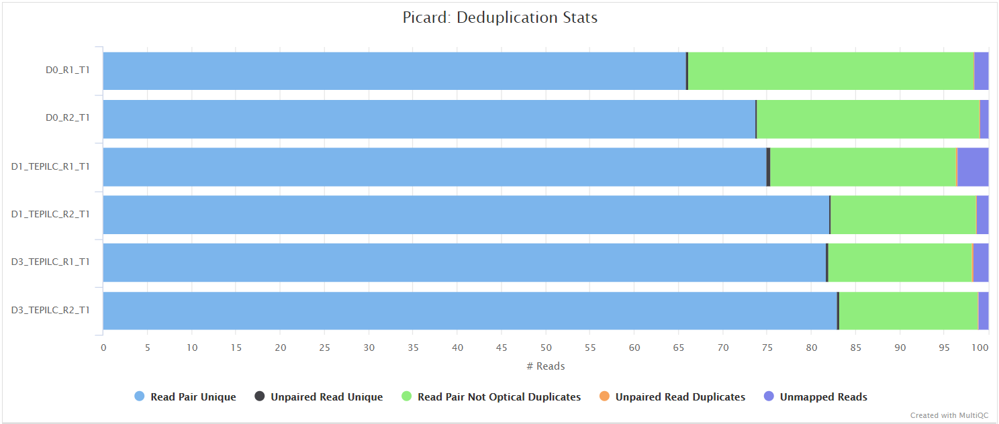

Read duplicate marking is carried out using the Picard MarkDuplicates command. Duplicate reads are generally removed from the aligned reads to mitigate for fragments in the library that may have been sequenced more than once due to PCR biases. There is an option to keep duplicate reads with the `--keep_dups` parameter but its generally recommended to remove them to avoid the wrong interpretation of the results. A similar option has been provided to keep reads that are multi-mapped - `--keep_multi_map`. Other steps have been incorporated into the pipeline to filter the resulting alignments - see [`main README.md`](../README.md) for a more comprehensive listing, and the tools used at each step. A selection of alignment-based QC metrics generated by Picard CollectMultipleMetrics and MarkDuplicates will be included in the MultiQC report.

Certain cell types and tissues yield an enormous fraction (typically 20–80%) of unusable sequences of mitochondrial origin. This is a known problem that is specific to ATAC-seq library preps - see [Montefiori et al. 2017](https://www.nature.com/articles/s41598-017-02547-w). There is an option to keep these reads using the `--keep_mito` parameter but its generally recommended to remove these in order to get a more reliable assessment of the duplication rate from the rest of the genome, and to avoid any biases in the downstream analyses.

The [Preseq](http://smithlabresearch.org/software/preseq/) package is aimed at predicting and estimating the complexity of a genomic sequencing library, equivalent to predicting and estimating the number of redundant reads from a given sequencing depth and how many will be expected from additional sequencing using an initial sequencing experiment. The estimates can then be used to examine the utility of further sequencing, optimize the sequencing depth, or to screen multiple libraries to avoid low complexity samples. The dashed line shows a perfectly complex library where total reads = unique reads. Note that these are predictive numbers only, not absolute. The MultiQC plot can sometimes give extreme sequencing depth on the X axis - click and drag from the left side of the plot to zoom in on more realistic numbers.

### Normalised bigWig files

    
Output files

* `bwa/mergedLibrary/bigwig/`
    * `*.bigWig`: Normalised bigWig files scaled to 1 million mapped reads.

The [bigWig](https://genome.ucsc.edu/goldenpath/help/bigWig.html) format is in an indexed binary format useful for displaying dense, continuous data in Genome Browsers such as the [UCSC](https://genome.ucsc.edu/cgi-bin/hgTracks) and [IGV](http://software.broadinstitute.org/software/igv/). This mitigates the need to load the much larger BAM files for data visualisation purposes which will be slower and result in memory issues. The coverage values represented in the bigWig file can also be normalised in order to be able to compare the coverage across multiple samples - this is not possible with BAM files. The bigWig format is also supported by various bioinformatics software for downstream processing such as meta-profile plotting.

### Coverage QC

    
Output files

* `bwa/mergedLibrary/deepTools/plotFingerprint/`
    * `*.plotFingerprint.pdf`, `*.plotFingerprint.qcmetrics.txt`, `*.plotFingerprint.raw.txt`: plotFingerprint output files.
* `bwa/mergedLibrary/deepTools/plotProfile/`
    * `*.computeMatrix.mat.gz`, `*.computeMatrix.vals.mat.tab`, `*.plotProfile.pdf`, `*.plotProfile.tab`, `*.plotHeatmap.pdf`, `*.plotHeatmap.mat.tab`: plotProfile output files.

[deepTools](https://deeptools.readthedocs.io/en/develop/content/list_of_tools.html) plotFingerprint is a useful QC for ATAC-seq data in order to see the relative enrichment of the samples in the experiment on a genome-wide basis (see [plotFingerprint docs](https://deeptools.readthedocs.io/en/develop/content/tools/plotFingerprint.html)).

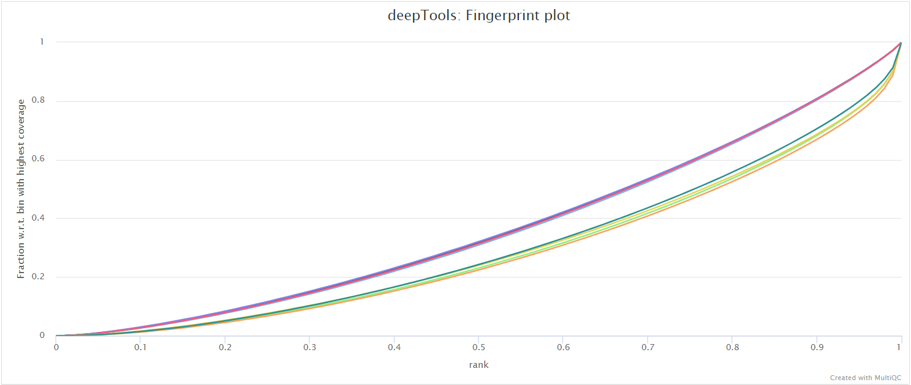

The results from deepTools plotProfile gives you a quick visualisation for the genome-wide enrichment of your samples at the TSS, and across the gene body. During the downstream analysis, you may want to refine the features/genes used to generate these plots in order to see a more specific condition-related effect.

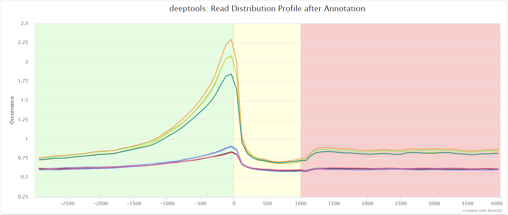

### Call peaks

    
Output files

* `bwa/mergedLibrary/macs/<PEAK_TYPE>/`
    * `*.xls`, `*.broadPeak` or `*.narrowPeak`, `*.gappedPeak`, `*summits.bed`: MACS2 output files - the files generated will depend on whether MACS2 has been run in *narrowPeak* or *broadPeak* mode.
    * `*.annotatePeaks.txt`: HOMER peak-to-gene annotation file.
* `bwa/mergedLibrary/macs/<PEAK_TYPE>/qc/`
    * `macs_peak.plots.pdf`: QC plots for MACS2 peaks.
    * `macs_annotatePeaks.plots.pdf`: QC plots for peak-to-gene feature annotation.
    * `*.FRiP_mqc.tsv`, `*.count_mqc.tsv`, `macs_annotatePeaks.summary_mqc.tsv`: MultiQC custom-content files for FRiP score, peak count and peak-to-gene ratios.

> **NB:** `<PEAK_TYPE>` in the directory structure above corresponds to the type of peak that you have specified to call with MACS2 i.e. `broadPeak` or `narrowPeak`. If you so wish, you can call both narrow and broad peaks without redoing the preceding steps in the pipeline such as the alignment and filtering. For example, if you already have broad peaks then just add `--narrow_peak -resume` to the command you used to run the pipeline, and these will be called too! However, resuming the pipeline will only be possible if you have not deleted the `work/` directory generated by the pipeline.

[MACS2](https://github.com/taoliu/MACS) is one of the most popular peak-calling algorithms for ChIP-seq data. For ATAC-seq data we are also looking for genome-wide regions of enrichment but in this case without comparison to a standard control sample (e.g. input DNA). By default, the peaks are called with the MACS2 `--broad` parameter. If, however, you would like to call narrow peaks then please provide the `--narrow_peak` parameter when running the pipeline. See [MACS2 outputs](https://github.com/taoliu/MACS#output-files) for a description of the output files generated by MACS2.

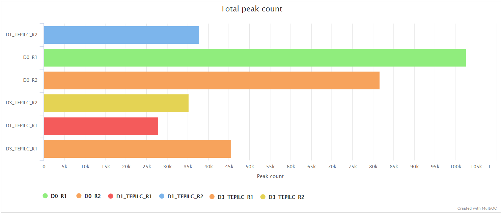

[HOMER annotatePeaks.pl](http://homer.ucsd.edu/homer/ngs/annotation.html) is used to annotate the peaks relative to known genomic features. HOMER is able to use the `--gtf` annotation file which is provided to the pipeline. Please note that some of the output columns will be blank because the annotation is not provided using HOMER's in-built database format. However, the more important fields required for downstream analysis will be populated i.e. *Annotation*, *Distance to TSS* and *Nearest Promoter ID*.

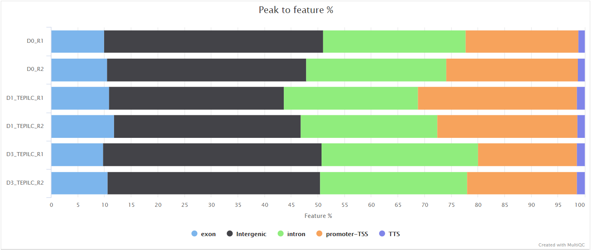

Various QC plots per sample including number of peaks, fold-change distribution, [FRiP score](https://genome.cshlp.org/content/22/9/1813.full.pdf+html) and peak-to-gene feature annotation are also generated by the pipeline. Where possible these have been integrated into the MultiQC report.

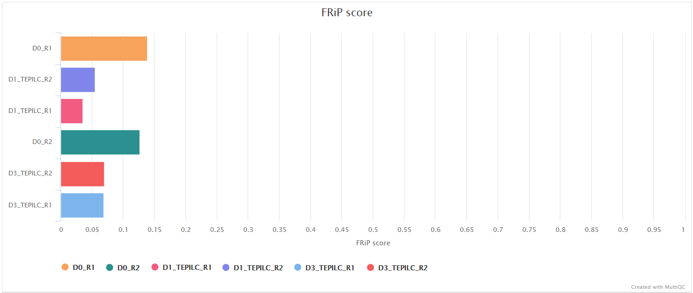

### Create and quantify consensus set of peaks

    
Output files

* `bwa/mergedLibrary/macs/<PEAK_TYPE>/consensus/`
    * `*.bed`: Consensus peak-set across all samples in BED format.
    * `*.saf`: Consensus peak-set across all samples in SAF format. Required by featureCounts for read quantification.
    * `*.featureCounts.txt`: Read counts across all samples relative to consensus peak-set.
    * `*.annotatePeaks.txt`: HOMER peak-to-gene annotation file for consensus peaks.
    * `*.boolean.annotatePeaks.txt`: Spreadsheet representation of consensus peak-set across samples **with** gene annotation columns. The columns from individual peak files are included in this file along with the ability to filter peaks based on their presence or absence in multiple replicates/conditions.
    * `*.boolean.txt`: Spreadsheet representation of consensus peak-set across samples **without** gene annotation columns. Same as file above but without annotation columns.
    * `*.boolean.intersect.plot.pdf`, `*.boolean.intersect.txt`: [UpSetR](https://cran.r-project.org/web/packages/UpSetR/README.html) files to illustrate peak intersection.

In order to perform the differential accessibility analysis we need to be able to carry out the read quantification for the same intervals across **all** of the samples in the experiment. To this end, the individual peak-sets called per sample have to be merged together in order to create a consensus set of peaks.

Using the consensus peaks it is possible to assess the degree of overlap between the peaks from a set of samples e.g. *Which consensus peaks contain peaks that are common/unique to a given set of samples?*. This may be useful for downstream filtering of peaks based on whether they are called in multiple replicates/conditions. Please note that it is possible for a consensus peak to contain multiple peaks from the same sample. Unfortunately, this is sample-dependent but the files generated by the pipeline do have columns that report such instances and allow you to factor them into any further analysis.

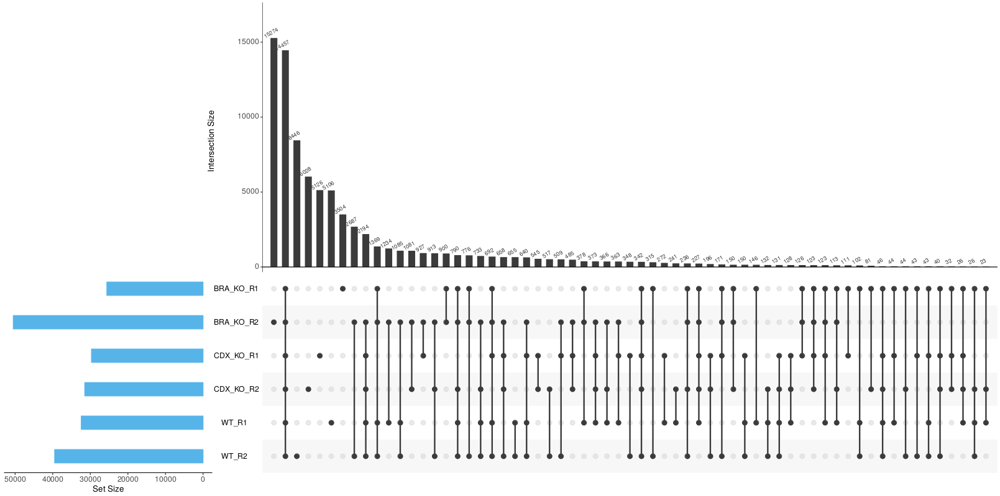

By default, the peak-sets are not filtered, therefore, the consensus peaks will be generated across the union set of peaks from all samples. However, you can increment the `--min_reps_consensus` parameter appropriately if you are confident you have good reproducibility amongst your replicates to create a "reproducible" set of consensus of peaks. In future iterations of the pipeline more formal analyses such as [IDR](https://projecteuclid.org/euclid.aoas/1318514284) may be implemented to obtain reproducible and high confidence peak-sets with which to perform this sort of analysis.

The [featureCounts](http://bioinf.wehi.edu.au/featureCounts/) tool is used to count the number of reads relative to the consensus peak-set across all of the samples. This essentially generates a file containing a matrix where the rows represent the consensus intervals, the columns represent all of the samples in the experiment, and the values represent the raw read counts.

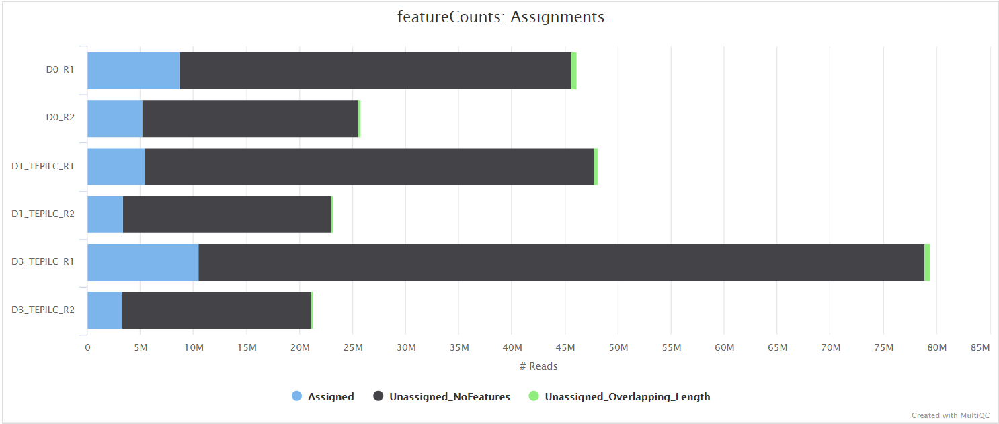

### Read counting and differential accessibility analysis

    
Output files

* `bwa/mergedLibrary/macs/<PEAK_TYPE>/consensus/deseq2/`
    * `*.results.txt`: Spreadsheet containing differential accessibility results across all consensus peaks and all comparisons.
    * `*.plots.pdf`: File containing PCA and hierarchical clustering plots.
    * `*.log`: Log file with information for number of differentially accessible intervals at different FDR and fold-change thresholds for each comparison.
    * `*.dds.rld.RData`: File containing R `dds` and `rld` objects generated by DESeq2.
    * `R_sessionInfo.log`: File containing information about R, the OS and attached or loaded packages.
* `bwa/mergedLibrary/macs/<PEAK_TYPE>/consensus/<COMPARISON>/`
    * `*.results.txt`: Spreadsheet containing comparison-specific DESeq2 output for differential accessibility results across all peaks.
    * `*FDR0.01.results.txt`, `*FDR0.05.results.txt`: Subset of above file for peaks that pass FDR <= 0.01 and FDR <= 0.05.
    * `*FDR0.01.results.bed`, `*FDR0.05.results.bed`: BED files for peaks that pass FDR <= 0.01 and FDR <= 0.05.
    * `*deseq2.plots.pdf`: MA, Volcano, clustering and scatterplots at FDR <= 0.01 and FDR <= 0.05.
* `bwa/mergedLibrary/macs/<PEAK_TYPE>/consensus/sizeFactors/`
    * `*.txt`, `*.RData`: Files containing DESeq2 sizeFactors per sample.

[DESeq2](https://bioconductor.org/packages/release/bioc/vignettes/DESeq2/inst/doc/DESeq2.html) is more commonly used to perform differential expression analysis for RNA-seq datasets. However, it can also be used for ATAC-seq differential accessibility analysis, in which case you can imagine that instead of counts per gene for RNA-seq data we now have counts per accessible region.

This pipeline uses a standardised DESeq2 analysis script to get an idea of the reproducibility within the experiment, and to assess the overall differential accessibility. Please note that this will not suit every experimental design, and if there are other problems with the experiment then it may not work as well as expected. For larger experiments, it may be recommended to use the `vst` transformation instead of the default `rlog` option. You can do this by providing the `--deseq2_vst` parameter to the pipeline. See [DESeq2 docs](http://bioconductor.org/packages/devel/bioc/vignettes/DESeq2/inst/doc/DESeq2.html#data-transformations-and-visualization) for a more detailed explanation.

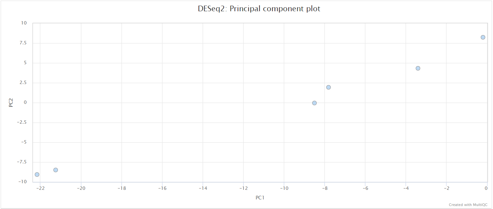

    

By default, all possible pairwise comparisons across the groups are performed (as defined in [`design.csv`](usage.md#--design)). The DESeq2 results are generated by the pipeline in various ways. You can load up the results across all of the comparisons in a single spreadsheet, or individual folders will also be created that contain the results specific to a particular comparison. For the latter, additional files will also be generated where the intervals have been pre-filtered based on a couple of standard FDR thresholds. Please see [DESeq2 output](http://bioconductor.org/packages/release/bioc/vignettes/DESeq2/inst/doc/DESeq2.html#differential-expression-analysis) for a description of the columns generated by DESeq2.

    

    

### ataqv

    
Output files

* `bwa/mergedLibrary/ataqv/<PEAK_TYPE>/`
    * `.json`: JSON files containing ATAC-seq specific metrics for each sample.
* `bwa/mergedLibrary/ataqv/<PEAK_TYPE>/html/`
    * Folder containing ataqv results aggregated across all samples for visualisation via an internet browser.

[ataqv](https://parkerlab.github.io/ataqv/) is a toolkit for measuring and comparing ATAC-seq results. It was written to help understand how well ATAC-seq assays have worked, and to make it easier to spot differences that might be caused by library prep or sequencing. Please see [ataqv homepage](https://parkerlab.github.io/ataqv/) for documentation and an example report.

## Merged replicate-level analysis

The alignments associated with all of the replicates from the same experimental condition can also be merged. This can be useful to increase the coverage for peak-calling and for other analyses that require high sequencing depth such as [motif footprinting](https://www.ncbi.nlm.nih.gov/pmc/articles/PMC3959825/). The analysis steps and directory structure for `bwa/mergedLibrary/` and `bwa/mergedReplicate/` are almost identical.

File names in the resulting directory (i.e. `bwa/mergedReplicate/`) will have the '`.mRp.`' suffix.

You can skip this portion of the analysis by specifying the `--skip_merge_replicates` parameter.

> **NB:** Merged library-level alignments will be used for read counting relative to the consensus merged replicate-level peakset. This is the only way in which differential analysis can be performed at the merged replicate-level.

## Aggregate analysis

### Present QC for the raw read, alignment, peak and differential accessibility results

    
Output files

* `multiqc/<PEAK_TYPE>/`
    * `multiqc_report.html`: A standalone HTML file that can be viewed in your web browser.
    * `multiqc_data/`: Directory containing parsed statistics from the different tools used in the pipeline.
    * `multiqc_plots/`: Directory containing static images from the report in various formats.

[MultiQC](https://multiqc.info/docs/) is a visualisation tool that generates a single HTML report summarising all samples in your project. Most of the pipeline QC results are visualised in the report and further statistics are available within the report data directory.

Results generated by MultiQC collate pipeline QC from FastQC, TrimGalore, samtools flagstat, samtools idxstats, samtools stats, picard CollectMultipleMetrics, picard MarkDuplicates, Preseq, deepTools plotProfile, deepTools plotFingerprint and featureCounts. The default [`multiqc config file`](../assets/multiqc_config.yaml) also contains the provision for loading custom-content to report peak counts, FRiP scores, peak-to-gene annnotation proportions, sample-similarity heatmaps and PCA plots.

The pipeline has special steps which also allow the software versions to be reported in the MultiQC output for future traceability. For more information about how to use MultiQC reports, see <http://multiqc.info>.

### Create IGV session file

    
Output files

* `igv/<PEAK_TYPE>/`
    * `igv_session.xml`: Session file that can be directly loaded into IGV.
    * `igv_files.txt`: File containing a listing of the files used to create the IGV session.

An [IGV](https://software.broadinstitute.org/software/igv/UserGuide) session file will be created at the end of the pipeline containing the normalised bigWig tracks, per-sample peaks, consensus peaks and differential sites. This avoids having to load all of the data individually into IGV for visualisation.

The genome fasta file required for the IGV session will be the same as the one that was provided to the pipeline. This will be copied into `genome/` to overcome any loading issues. If you prefer to use another path or an in-built genome provided by IGV just change the `genome` entry in the second-line of the session file.

The file paths in the IGV session file will only work if the results are kept in the same place on your storage. If the results are moved or for example, if you prefer to load the data over the web then just replace the file paths with others that are more appropriate.

Once installed, open IGV, go to `File > Open Session` and select the `igv_session.xml` file for loading.

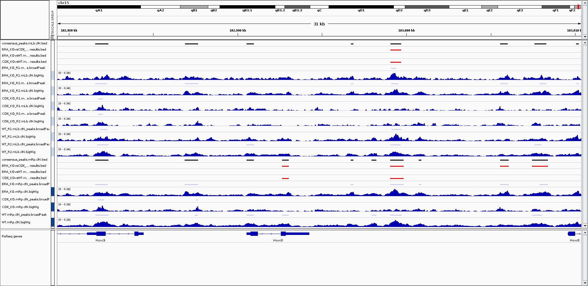

> **NB:** If you are not using an in-built genome provided by IGV you will need to load the annotation yourself e.g. in .gtf and/or .bed format.

## Other results

### Reference genome files

    
Output files

* `genome/`
    * A number of genome-specific files are generated by the pipeline in order to aid in the filtering of the data, and because they are required by standard tools such as BEDTools. These can be found in this directory along with the genome fasta file which is required by IGV. If using a genome from AWS iGenomes and if it exists a `README.txt` file containing information about the annotation version will also be saved in this directory.
* `genome/BWAIndex/`
    * If the `--save_reference` parameter is provided then the alignment indices generated by the pipeline will be saved in this directory. This can be quite a time-consuming process so it permits their reuse for future runs of the pipeline or for other purposes.

Reference genome-specific files can be useful to keep for the downstream processing of the results.

### Pipeline information

    
Output files

* `pipeline_info/`
    * `pipeline_report.html`, `pipeline_report.txt`, `software_versions.csv`: Reports generated by the pipeline.
    * `execution_report.html`, `execution_timeline.html`, `execution_trace.txt`, `pipeline_dag.svg`: Reports generated by Nextflow.
    * `design_reads.csv`: Reformatted design files used as input to the pipeline.
    * `results_description.html`: Documentation for interpretation of results in HTML format.

[Nextflow](https://www.nextflow.io/docs/latest/tracing.html) provides excellent functionality for generating various reports relevant to the running and execution of the pipeline. This will allow you to trouble-shoot errors with the running of the pipeline, and also provide you with other information such as launch commands, run times and resource usage.
