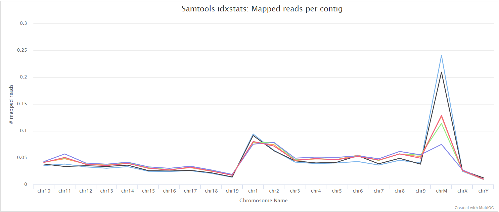
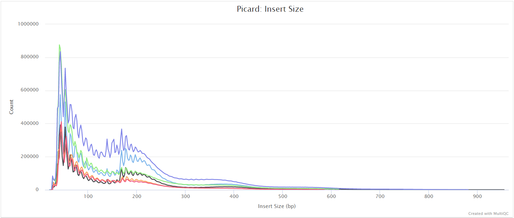
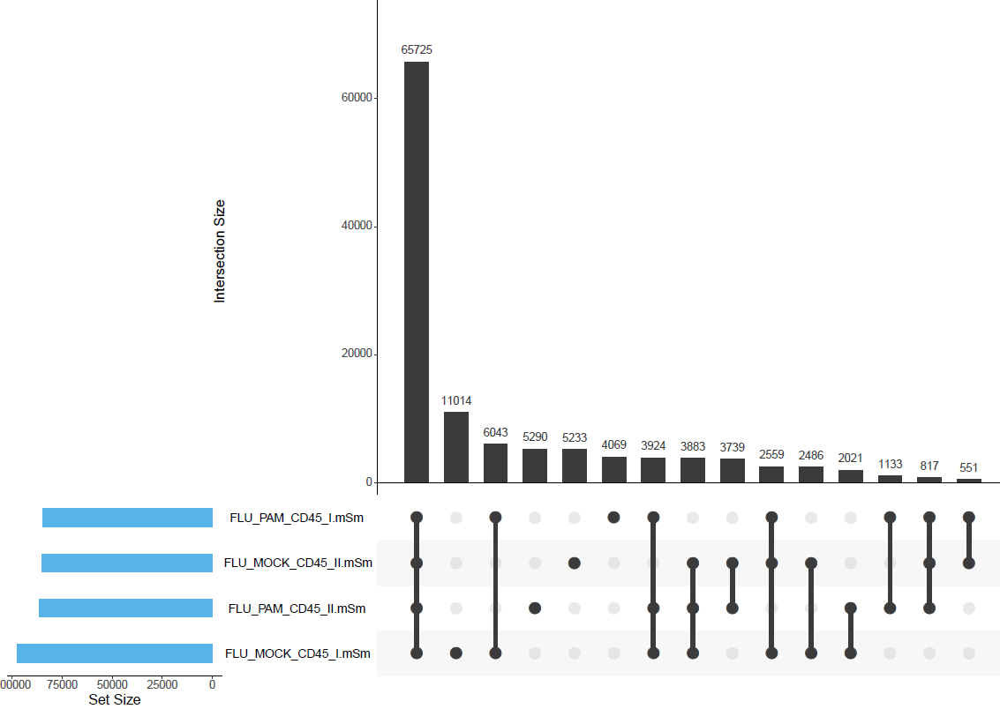
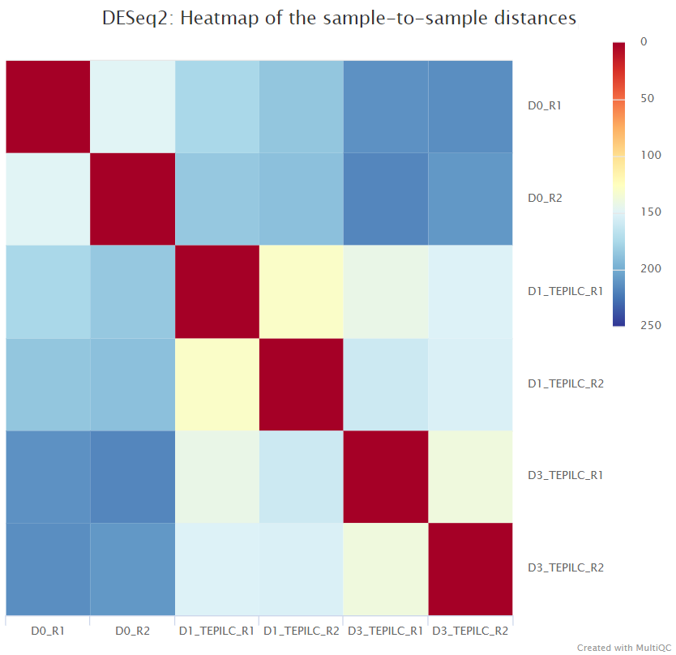

# nf-core/atacseq: Output

This document describes the output produced by the pipeline. Most of the plots are taken from the MultiQC report, which summarises results at the end of the pipeline.

## Pipeline overview
The pipeline is built using [Nextflow](https://www.nextflow.io/). The initial QC and alignments are performed at the library-level e.g. if the same library has been sequenced more than once to increase sequencing depth. This has the advantage of being able to assess each library individually, and the ability to process multiple libraries from the same sample in parallel. The alignments are subsequently merged at the replicate-level and the sample-level. The latter involves merging the alignments across all replicates from the same experimental condition. This can be useful to increase the coverage for peak-calling and for other analyses that require high sequencing depth such as [motif footprinting](https://www.ncbi.nlm.nih.gov/pmc/articles/PMC3959825/). See [main README.md](../README.md) for an overview of the pipeline, and the bioinformatics tools used at each step.

## Library-level analysis

The following directories will be created in the output directory after the pipeline has finished. All paths are relative to the top-level results directory.

1. **Raw read QC**

    *Software*: [`FastQC`](https://www.bioinformatics.babraham.ac.uk/projects/trim_galore/)  

    *Description*: [FastQC](http://www.bioinformatics.babraham.ac.uk/projects/fastqc/) gives general quality metrics about your reads. It provides information about the quality score distribution across your reads, the per base sequence content (%T/A/G/C). You get information about adapter contamination and other overrepresented sequences. For further reading and documentation see the [FastQC help](http://www.bioinformatics.babraham.ac.uk/projects/fastqc/Help/).

  * *Output directories*:
        * `fastqc/`  
        FastQC html files for read 1 (and read2 if paired-end) **before** adapter trimming.

        * `fastqc/zips/`    
        FastQC zip files for read 1 (and read2 if paired-end) **before** adapter trimming.  

<!---

2. Adapter trimming   

By default, Trim Galore! will automatically detect and trim the Nextera adapter sequence (i.e. 'CTGTCTCTTATA') which is almost always present in ATAC-seq library preps.

  * `trim_galore/`  
  If `--saveTrimmed` is specified fastq files **after** adapter trimming will be placed in this directory.

  * `trim_galore/logs/`  
   Log files generated by Trim Galore!.

  

  * `trim_galore/fastqc/`
  FastQC html files for read 1 (and read2 if paired-end) **after** adapter trimming
  * `trim_galore/fastqc/zips/`  
  FastQC zip files for read 1 (and read2 if paired-end) **after** adapter trimming.

*Software*: [`Trim Galore!`](https://www.bioinformatics.babraham.ac.uk/projects/trim_galore/)

3. Alignment, duplicate marking and filtering

  * `bwa/library/`  
  Filtered, coordinate sorted alignment files in [`BAM`](https://samtools.github.io/hts-specs/SAMv1.pdf) format at the library-level.

  * `bwa/library/flagstat/`
  Multiple BAM files will be generated before the final filtered BAM file is created. The SAMtools flagstat files for a selection of these will be placed in this directory.

  * `bwa/library/idxstats/`
  SAMtools idxstats files to determine the percentage of reads mapping to mitochondrial DNA.

  

  * `bwa/library/picard_metrics/`
  Alignment QC files from picard CollectMultipleMetrics and the metrics file from MarkDuplicates.

  
  

  * `bwa/library/picard_metrics/pdf/`
  Alignment QC plot files from picard CollectMultipleMetrics and the metrics file from MarkDuplicates.

*Software*: [`BWA`](https://sourceforge.net/projects/bio-bwa/files/)

## Replicate-level analysis
    1. Alignment merging, duplicate marking and removal - [`picard`](https://broadinstitute.github.io/picard/)

        * `bwa/replicate/` - Replicate-level, merged, coordinate sorted BAM files after the re-marking and removal of duplicates.                                                                                                                                                                                                       
        * `bwa/replicate/flagstat/` - Flagstat files associated with the final filtered merged BAM file.                                                                                                                                                                                                                                         
        * `bwa/replicate/picard_metrics/` - Metrics file from MarkDuplicates.                                                                                                                                                                                                                                                                          

    2. Normalised bigWig files - [`BEDTools`](https://github.com/arq5x/bedtools2/), [`wigToBigWig`](http://hgdownload.soe.ucsc.edu/admin/exe/)
        * `bwa/replicate/bigwig/` - Normalised [`bigWig`](https://genome.ucsc.edu/goldenpath/help/bigWig.html) files scaled to 1 million mapped reads.                                                                                                                                                                                         

    3. TSS meta-profiles - [`deepTools`](https://deeptools.readthedocs.io/en/develop/)
        * `bwa/replicate/deeptools/` - TSS meta-profile plot for coverage across all genes. Generated with deepTools *computeMatrix* and *plotProfile* commands.                                                                                                                                                                                  

        

    4. Call peaks - [`MACS2`](https://github.com/taoliu/MACS)

        * `bwa/replicate/macs2/` - MACS2 output files: `*.xls`, `*.broadPeak` or `*.narrowPeak`, `*.gappedPeak` and `*summits.bed`. The files generated will depend on whether MACS2 has been run in narrowPeak or broadPeak mode.                                                                                                            
                                   HOMER peak-to-gene annotation file: `*.annotatePeaks.txt`.                                                                                                                                                                                                                                                  
        * `bwa/replicate/macs2/qc/` - Peak QC plots including fold-change distribution and peak percentage across gene features: `*.pdf`.                                                                                                                                                                                                        
                                      MultiQC custom-content files for [`FRiP score`](https://genome.cshlp.org/content/22/9/1813.full.pdf+html) and peak count: `*.FRiP_mqc.tsv` and `*_peaks.count_mqc.tsv`.                                                                                                                                     

            
            

    6. Annotate peaks - [`HOMER`](http://homer.ucsd.edu/homer/download.html)

        

    7. Create consensus set of peaks - [`BEDTools`](https://github.com/arq5x/bedtools2/)

        * `bwa/replicate/macs2/merged/` - Consensus peak-set across all samples in BED format: `*.bed`.                                                                                                                                                                                                                                              
                                          Consensus peak-set across all samples in SAF format: `*.saf`. Required by featureCounts.                                                                                                                                                                                                                   
                                          HOMER peak-to-gene annotation file for consensus peak-set: `*.annotatePeaks.txt`.                                                                                                                                                                                                                          
                                          Spreadsheet representation of merged peak set across samples **with** gene annotation columns: `*.boolean.annotatePeaks.txt`. The columns from individual peak files are included in this file along with the ability to filter peaks based on their presence or absence in multiple replicates/conditions.
                                          Spreadsheet representation of merged peak set across samples **without** gene annotation columns: `*.boolean.txt`. Use file above for downstream analysis.                                                                                           
                                          [`UpSetR`](https://cran.r-project.org/web/packages/UpSetR/README.html) files to illustrate peak intersection: `*.boolean.intersect.plot.pdf` and `*.boolean.intersect.txt`.                                                                          

        

    8. Read counting relative to consensus set of peaks - [`featureCounts`](http://bioinf.wehi.edu.au/featureCounts/)

        

    9. Differential binding analysis, PCA and clustering - [`R`](https://www.r-project.org/), [`DESeq2`](https://bioconductor.org/packages/release/bioc/html/DESeq2.html)

        * `bwa/replicate/macs2/merged/deseq2/` - Differential binding results across all merged peaks and all comparisons: `*.results.txt`                                                                                                                                                            
                                                 Plots for PCA, hierarchical clustering,and DESeq2 dispersion estimates and variance stabilizing transformation: `*.plots.pdf`                                                                                                                        
                                                 Log file with information for number of genes differentially bound at different FDR and fold-change thresholds for each comparison: `*log`.                                                                                                          
                                                 R data file containing `dds` and `rld` objects generated by [DESeq2](https://bioconductor.org/packages/release/bioc/vignettes/DESeq2/inst/doc/DESeq2.html#the-deseqdataset): `*.dds.rld.RData`                                                       
                                                 R sessionInfo log file containing information about R, the OS and attached or loaded packages: `R_sessionInfo.log`.                                                                                                                                  
        * `bwa/replicate/macs2/merged/deseq2/<COMPARISON>/` - Spreadsheet containing comparison-specific DESeq2 output for differential binding results across all peaks: '`*.results.txt`'                                                                                                                        
                                                              Subset of above file for peaks that pass FDR <= 0.01 (`*FDR0.01.results.txt`), FDR <= 0.01 and fold-change >= 2 (`*FDR0.01.FC2.results.txt`), FDR <= 0.05 (`*FDR0.05.results.txt`) and FDR <= 0.05 and fold-change >= 2 (`*FDR0.05.FC2.results.txt`).
                                                              BED files for peaks that pass FDR <= 0.01 (`*FDR0.01.results.bed`), FDR <= 0.01 and fold-change >= 2 (`*FDR0.01.FC2.results.bed`), FDR <= 0.05 (`*FDR0.05.results.bed`) and FDR <= 0.05 and fold-change >= 2 (`*FDR0.05.FC2.results.bed`).
                                                              MA, Volcano, clustering and scatterplots at FDR <= 0.01 and FDR <= 0.05: `*deseq2.plots.pdf`.
        * `bwa/replicate/macs2/merged/deseq2/sizeFactors/`  - Files containing DESeq2 sizeFactors per sample: `*.txt` and `*.RData`.

            
            

## Sample-level analysis

    * `bwa/sample/` - The analysis steps and directory structure for `bwa/replicate/` and `bwa/sample/` are almost identical. The main difference is that multiple libraries sequenced from the same sample will be merged at the replicate-level whereas all the replicates associated with an experimental condition will be merged at the sample-level.

    >NB: Replicate-level alignments will be used for read counting relative to the consensus sample-level peakset. This is the only way in which differential analysis can be performed at the sample-level.

## Aggregate analysis
    1. Collect and present QC at the raw read, alignment and peak-level - [`MultiQC`](http://multiqc.info/) & [`R`](https://www.r-project.org/)
        * `multiqc/` - Results generated by MultiQC to collate pipeline QC from FastQC, TrimGalore, samtools flagstat, samtools idxstats, picard CollectMultipleMetrics, picard MarkDuplicates, featureCounts. The default [multiqc config file](../assets/multiqc_config.yaml) also contains the provision for loading custom-content to report peak counts, FriP scores and peak to gene annnotation proportions.

    2. Create IGV session file containing bigWig tracks, peaks and differential sites for data visualisation - [`IGV`](https://software.broadinstitute.org/software/igv/)

        * `igv/` - An IGV session file called `igv_session.xml` will be created at the end of the pipeline. This avoids having to load all the data individually into IGV for visualisation. Once installed, open IGV, go to `File > Open Session` and select the `igv_session.xml` file for loading.
                   File paths in the IGV session file will be set as absolute paths to the directory containing the results. If you prefer to load the data over the web you can just replace the relevant portion of the file path with a link in the session file.
                   The path to the genome fasta file provided to the pipeline will be set as the genome for the IGV session. If you prefer to use an in-built genome provided by IGV just change the file path to the name of the IGV genome e.g. mm10 or hg19.

## Other results
    1. Reference genome files
        *`reference_genome/` - If the `--saveReference` parameter is provided then genome-specific files and alignment indices generated by the pipeline will be saved in this directory.

    2. Pipeline information

        * `pipeline_info/` - Nextflow provides excellent functionality for generating various reports relevant to the running and execution of the pipeline. This will allow you to trouble-shoot errors with the running of the pipeline, and also provide you with other information such as launch commands, run times and resource usage. Default reports generated by the pipeline are `atacseq_report.html`, `atacseq_timeline.html`, `atacseq_trace.txt` and `atacseq_dag.dot`. See [Nextflow Tracing & visualisation](https://www.nextflow.io/docs/latest/tracing.html).

        * `Documentation/` - Additional reports and documentation generated by the pipeline i.e. `pipeline_report.html`, `pipeline_report.txt`, `results_description.html`.

-->
